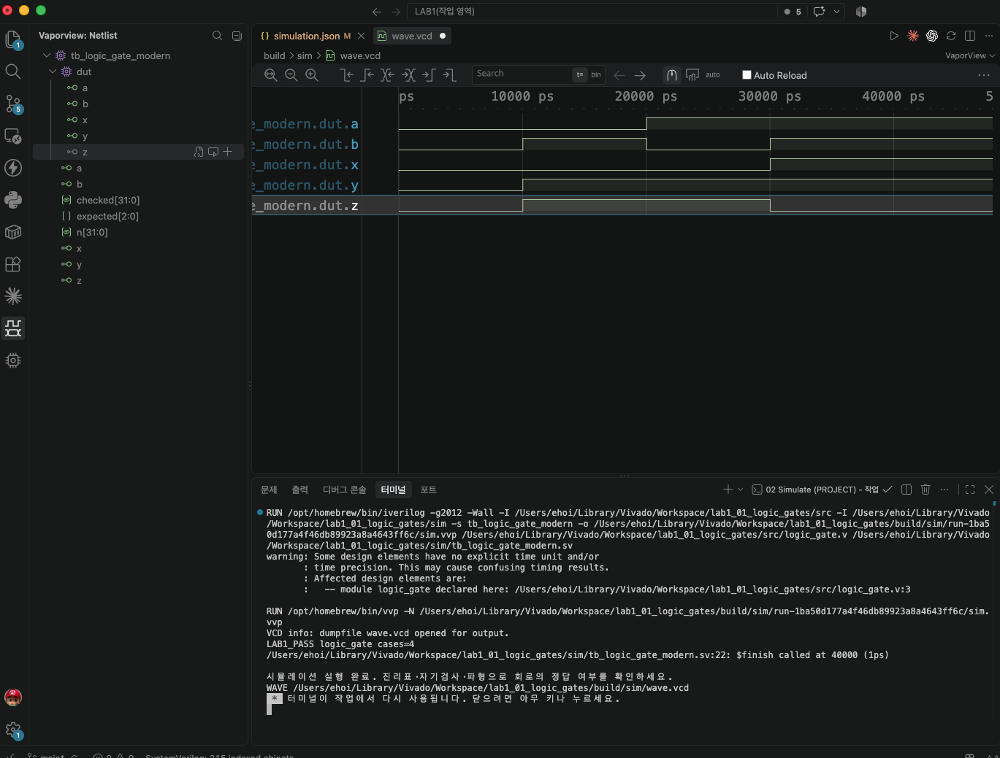

# LAB1 예비보고서 — 01 · AND/OR/XOR 로직 게이트

> SIMULATED는 컴파일·실행·파형 생성이 끝났다는 뜻이지 PASS 판정이 아니다. 아래 PASS 판정은 테스트벤치의 자기검사(`$fatal` 비교)를 전체 케이스에 대해 통과했다는 뜻이며, 근거는 [evidence/vscode/simulation.log](../../evidence/vscode/simulation.log)와 아래 캡처다.

## 1. 목적 · 포트 · 비트 폭 · 예상표 · 동작 원리

- 설계 top 모듈: `logic_gate`
- 포트: 입력 a, b (각 1비트) → 출력 x=AND, y=OR, z=XOR (각 1비트)
- 동작 원리: assign 세 줄로 a&b, a|b, a^b를 동시에 계산하는 순수 조합회로이다. 세 출력 모두 입력이 바뀌면 지연 없이 즉시 갱신된다.

실행 전 예상값 표 (PDF 제공 기준값):

| a b | x AND | y OR | z XOR |
| --- | --- | --- | --- |
| 00 | 0 | 0 | 0 |
| 01 | 0 | 1 | 1 |
| 10 | 0 | 1 | 1 |
| 11 | 1 | 1 | 0 |

*OR는 하나 이상 1, XOR는 두 입력이 서로 다를 때 1이다.*

## 2. 소스 · 테스트벤치 링크 · 코드 커밋 · 도구 버전

소스 파일:
- [`src/logic_gate.v`](../../src/logic_gate.v)

테스트벤치: [`sim/tb_logic_gate_modern.sv`](../../sim/tb_logic_gate_modern.sv) (simulation_top: `tb_logic_gate_modern`)

git 커밋: `2322898  lab1_01: logic_gate RTL/TB 작성 및 시뮬레이션 통과`

도구 버전 (01 Check tools 실행 결과):
```
git version 2.55.0
Python 3.9.6
Icarus Verilog version 13.0 (stable)
```

## 3. 입력 조합 · 기대값 · 자동 비교 · 종료 조건

- 입력 조합: {a,b}=n (n=0..3)으로 00→01→10→11 순서로 대입, 각 10ns 유지
- 자동 비교 방식: {x,y,z}를 기대값과 !==(4-state 비교)로 대조한다. 불일치 시 $fatal로 즉시 중단하고 입력·기대값·실제값을 출력한다. checked 카운터가 4와 같은지 확인한 뒤 LAB1_PASS 문구를 출력하고 $finish로 종료한다.
- 총 검사 수: 4개 × 10ns = 40ns에 정상 종료
- Watchdog: 100000ns 안에 `$finish`가 호출되지 않으면 강제로 실패 처리한다.

## 4. PASS 로그와 파형 원본 · 캡처

```
LAB1_PASS logic_gate cases=4
$finish called at 40000 (1ps)  ->  40ns 종료
```



이 캡처의 터미널에서 위 `LAB1_PASS logic_gate cases=4` 문구를 직접 확인했다.

원본 자료: [simulation.log](../../evidence/vscode/simulation.log) · [wave.vcd](../../evidence/vscode/wave.vcd)

## 5. 시간 구간별 값 해석

아래 표는 위 캡처(사진)에서 실제로 보이는 파형 구간 안의 값이다. 다중 비트는 이진수로 표기했다.

| 시간(ns) | a | b | x | y | z |
| --- | --- | --- | --- | --- | --- |
| 5 | 0 | 0 | 0 | 0 | 0 |
| 15 | 0 | 1 | 0 | 1 | 1 |
| 25 | 1 | 0 | 0 | 1 | 1 |
| 35 | 1 | 1 | 1 | 1 | 0 |

*캡처(사진)는 전체 40,000ps(=$finish 시각)가 모두 보이는 Zoom to Fit 화면이므로, 위 4개 시간 전부 화면에서 직접 확인 가능하다.*

## 6. 오류 · 수정 · 재실행 & 보드에서 확인할 입력과 출력

PDF 24~25쪽의 "코드 수정 실험"을 실제로 수행했다: logic_gate.v의 z를 XOR(^)에서 OR(|)로 바꾼 뒤(문법은 정상이지만 논리가 틀린 회로) 저장하고 02 Simulate를 재실행했다.

- 변경한 코드 (1줄): `assign z = a ^ b;  →  assign z = a | b;`
- 실패 로그: FAIL logic_gate vector=3 expected=6 actual=7 (Time: 40000) — a=1,b=1에서 정상 z=0(기대값 {x,y,z}=110=6)이어야 하는데, OR로 바뀌며 z=1(실제값 111=7)이 되어 실패.
- 복구 후 재실행 결과: OR를 XOR로 복구하고 Save All → 02 Simulate 재실행 → LAB1_PASS logic_gate cases=4, $finish called at 40000 (1ps)로 정상 종료 확인.

보드에서 확인할 입력과 출력: a=K4, b=N8, x=L4, y=M4, z=M2, 다섯 포트 모두 IOSTANDARD LVCMOS33 (constraints/logic_gate.xdc에 작성 완료).
