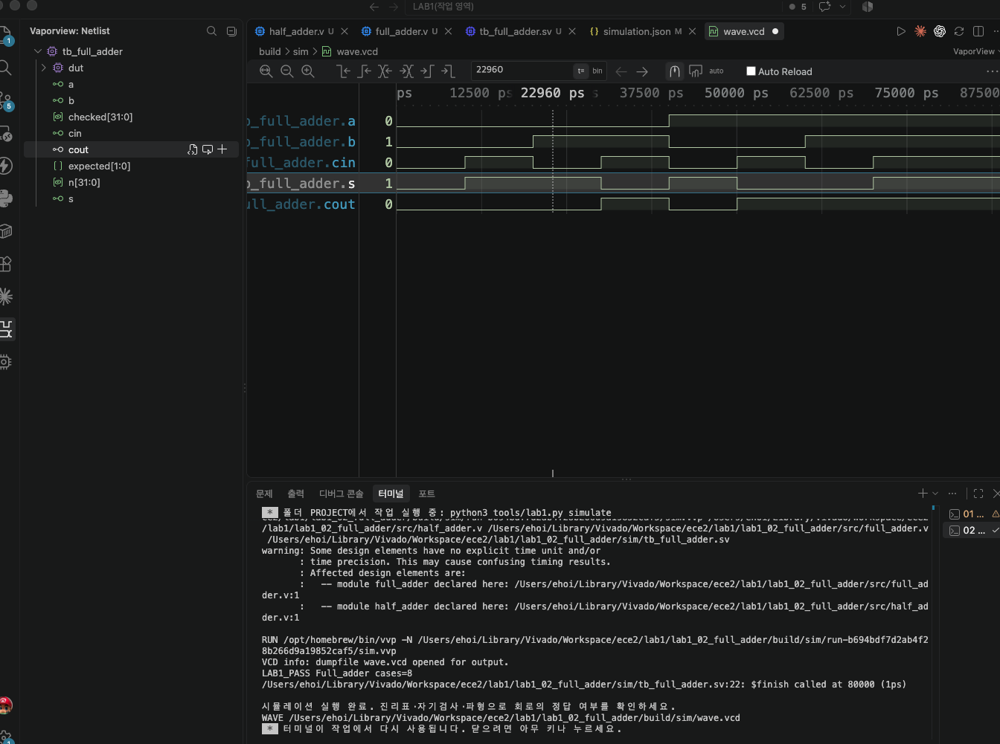

# LAB1 예비보고서 — 02 · 전가산기 (Full Adder)

> SIMULATED는 컴파일·실행·파형 생성이 끝났다는 뜻이지 PASS 판정이 아니다. 아래 PASS 판정은 테스트벤치의 자기검사(`$fatal` 비교)를 전체 케이스에 대해 통과했다는 뜻이며, 근거는 [evidence/vscode/simulation.log](../../evidence/vscode/simulation.log)와 아래 캡처다.

## 1. 목적 · 포트 · 비트 폭 · 예상표 · 동작 원리

- 설계 top 모듈: `full_adder`
- 포트: 입력 a, b, cin (각 1비트) → 출력 s(합), cout(자리올림) (각 1비트)
- 동작 원리: half_adder(assign s=a^b, c=a&b) 두 개를 직렬로 연결한다. 첫 half_adder가 a와 b를 더하고, 두 번째 half_adder가 그 합과 cin을 다시 더한다. 두 half_adder에서 나온 carry 두 개를 OR로 합쳐 최종 cout을 만든다.

실행 전 예상값 표 (PDF 제공 기준값):

| 입력(a,b,cin) | 예상 결과 |
| --- | --- |
| 000 | cout=0, s=0 |
| 011 | cout=1, s=0 |
| 111 | cout=1, s=1 |

*세 입력의 정수 합(0~3)이 2진수로 {cout,s}에 그대로 나타난다.*

## 2. 소스 · 테스트벤치 링크 · 코드 커밋 · 도구 버전

소스 파일:
- [`src/half_adder.v`](../../src/half_adder.v)
- [`src/full_adder.v`](../../src/full_adder.v)

테스트벤치: [`sim/tb_full_adder.sv`](../../sim/tb_full_adder.sv) (simulation_top: `tb_full_adder`)

git 커밋: `56c6f06  lab1_02: full_adder RTL/TB 작성 및 시뮬레이션 통과`

도구 버전 (01 Check tools 실행 결과):
```
git version 2.55.0
Python 3.9.6
Icarus Verilog version 13.0 (stable)
```

## 3. 입력 조합 · 기대값 · 자동 비교 · 종료 조건

- 입력 조합: {a,b,cin}=n (n=0..7)으로 8가지 조합을 대입, 각 10ns 유지
- 자동 비교 방식: 정수 덧셈 int(a)+int(b)+int(cin)을 기대값으로 계산해 {cout,s} 2비트와 비교(!==)한다. 불일치 시 $fatal. checked=8을 확인한 뒤 LAB1_PASS 출력, $finish.
- 총 검사 수: 8개 × 10ns = 80ns에 정상 종료
- Watchdog: 100000ns 안에 `$finish`가 호출되지 않으면 강제로 실패 처리한다.

## 4. PASS 로그와 파형 원본 · 캡처

```
LAB1_PASS full_adder cases=8
$finish called at 80000 (1ps)  ->  80ns 종료
```



이 캡처의 터미널에서 위 `LAB1_PASS full_adder cases=8` 문구를 직접 확인했다.

원본 자료: [simulation.log](../../evidence/vscode/simulation.log) · [wave.vcd](../../evidence/vscode/wave.vcd)

## 5. 시간 구간별 값 해석

아래 표는 위 캡처(사진)에서 실제로 보이는 파형 구간 안의 값이다. 다중 비트는 이진수로 표기했다.

| 시간(ns) | a | b | cin | s | cout |
| --- | --- | --- | --- | --- | --- |
| 5 | 0 | 0 | 0 | 0 | 0 |
| 15 | 0 | 0 | 1 | 1 | 0 |
| 35 | 0 | 1 | 1 | 0 | 1 |
| 45 | 1 | 0 | 0 | 1 | 0 |
| 75 | 1 | 1 | 1 | 1 | 1 |

*캡처(사진)는 전체 80,000ps 범위가 모두 보이며(커서가 22,960ps에 위치), 위 5개 시간 전부 화면에서 직접 확인 가능하다. ※ 최초 캡처 당시 TB의 문자열이 대문자 Full_adder였으나, 교안의 공식 통과 문구(소문자 full_adder)에 맞춰 TB를 수정하고 재실행했다. 이 캡처는 수정 전 화면이므로 재실행 후 새 캡처로 교체해야 한다.*

## 6. 오류 · 수정 · 재실행 & 보드에서 확인할 입력과 출력

PDF 26쪽의 "코드 수정 실험"을 실제로 수행했다: full_adder.v의 cout OR 연산자를 AND로 바꾼 뒤(assign cout = carry_ab & carry_cin;) 저장하고 02 Simulate를 재실행했다.

- 변경한 코드 (1줄): `assign cout = carry_ab | carry_cin;  →  assign cout = carry_ab & carry_cin;`
- 실패 로그: FAIL full_adder vector=3 expected=2 actual=0 (Time: 40000) — a=0,b=1,cin=1에서 정상 carry=1(기대값 2=10)이어야 하는데 AND로 바뀌며 carry=0(실제값 0=00)이 되어 실패.
- 복구 후 재실행 결과: OR로 복구하고 Save All → 02 Simulate 재실행 → LAB1_PASS full_adder cases=8, $finish called at 80000 (1ps)로 정상 종료 확인.

보드에서 확인할 입력과 출력: KEY1=a, KEY2=b, KEY3=cin. LED1=cout, LED2=s.
