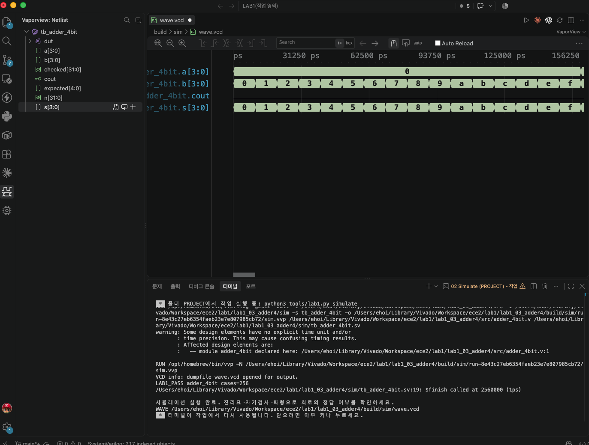

# LAB1 예비보고서 — 03 · 4비트 가산기

> SIMULATED는 컴파일·실행·파형 생성이 끝났다는 뜻이지 PASS 판정이 아니다. 아래 PASS 판정은 테스트벤치의 자기검사(`$fatal` 비교)를 전체 케이스에 대해 통과했다는 뜻이며, 근거는 [evidence/vscode/simulation.log](../../evidence/vscode/simulation.log)와 아래 캡처다.

## 1. 목적 · 포트 · 비트 폭 · 예상표 · 동작 원리

- 설계 top 모듈: `adder_4bit`
- 포트: 입력 a[3:0], b[3:0] → 출력 s[3:0](합), cout(자리올림)
- 동작 원리: assign {cout,s} = {1'b0,a} + {1'b0,b}; 두 4비트 수를 5비트로 확장해 더한 뒤, 상위 1비트를 cout으로 분리한다.

실행 전 예상값 표 (PDF 제공 기준값):

| 입력 | 예상 결과 |
| --- | --- |
| 0+0 | cout=0, s=0 |
| 1+15 | cout=1, s=0 |
| 15+15 | cout=1, s=14 |

*1+15=16이므로 하위 4비트 합은 0000이 되어도 carry(cout)가 1이 되어 전체 값은 16임에 유의한다.*

## 2. 소스 · 테스트벤치 링크 · 코드 커밋 · 도구 버전

소스 파일:
- [`src/adder_4bit.v`](../../src/adder_4bit.v)

테스트벤치: [`sim/tb_adder_4bit.sv`](../../sim/tb_adder_4bit.sv) (simulation_top: `tb_adder_4bit`)

git 커밋: `4a75d43  lab1_03: adder_4bit RTL/TB/XDC 작성 및 시뮬레이션 통과`

도구 버전 (01 Check tools 실행 결과):
```
git version 2.55.0
Python 3.9.6
Icarus Verilog version 13.0 (stable)
```

## 3. 입력 조합 · 기대값 · 자동 비교 · 종료 조건

- 입력 조합: {a,b}=n (n=0..255)로 0~15 두 수의 모든 조합(16×16=256가지)을 대입
- 자동 비교 방식: 기대값=(n/16)+(n%16) 정수합을 {cout,s} 5비트와 비교(!==). 불일치 시 $fatal. checked=256 확인 후 LAB1_PASS, $finish.
- 총 검사 수: 256개 × 10ns = 2560ns에 정상 종료
- Watchdog: 100000ns 안에 `$finish`가 호출되지 않으면 강제로 실패 처리한다.

## 4. PASS 로그와 파형 원본 · 캡처

```
LAB1_PASS adder_4bit cases=256
$finish called at 2560000 (1ps)  ->  2560ns 종료
```



이 캡처의 터미널에서 위 `LAB1_PASS adder_4bit cases=256` 문구를 직접 확인했다.

원본 자료: [simulation.log](../../evidence/vscode/simulation.log) · [wave.vcd](../../evidence/vscode/wave.vcd)

## 5. 시간 구간별 값 해석

아래 표는 위 캡처(사진)에서 실제로 보이는 파형 구간 안의 값이다. 다중 비트는 이진수로 표기했다.

| 시간(ns) | a[3:0] | b[3:0] | s[3:0] | cout |
| --- | --- | --- | --- | --- |
| 5 | 0000 | 0000 | 0000 | 0 |
| 35 | 0000 | 0011 | 0011 | 0 |
| 65 | 0000 | 0110 | 0110 | 0 |
| 95 | 0000 | 1001 | 1001 | 0 |
| 155 | 0000 | 1111 | 1111 | 0 |

*이 값은 캡처(사진)에 실제로 보이는 0~156,250ps 구간(전체 2,560,000ps 중 맨 앞부분, a=0000으로 고정된 첫 16케이스) 안에서 직접 읽은 것이다. 나머지 240케이스(a=0001~1111)는 화면에 없지만, checked==256 자기검사를 통과한 LAB1_PASS 로그로 전체 통과가 보증된다.*

## 6. 오류 · 수정 · 재실행 & 보드에서 확인할 입력과 출력

PDF 26쪽의 "코드 수정 실험"을 실제로 수행했다: adder_4bit.v의 덧셈 연산자를 뺄셈으로 바꾼 뒤 저장하고 02 Simulate를 재실행했다.

- 변경한 코드 (1줄): `assign {cout,s} = {1'b0,a} + {1'b0,b};  →  assign {cout,s} = {1'b0,a} - {1'b0,b};`
- 실패 로그: FAIL adder_4bit vector=1 expected=01 actual=1f (Time: 20000) — a=0,b=1에서 정상 결과는 cout=0,s=0001(=01)인데, 뺄셈으로 바뀌며 0-1의 4비트 wraparound로 cout=1,s=1111(=1f)이 되어 실패.
- 복구 후 재실행 결과: 덧셈으로 복구하고 Save All → 02 Simulate 재실행 → LAB1_PASS adder_4bit cases=256, $finish called at 2560000 (1ps)로 정상 종료 확인.

보드에서 확인할 입력과 출력: DIP1-4=a[3:0], DIP5-8=b[3:0]. LED1=cout, LED2-5=s[3:0].
