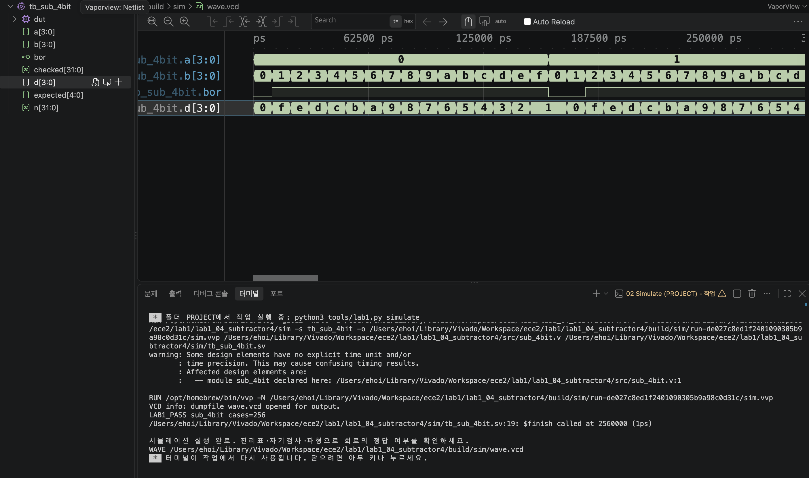

# LAB1 예비보고서 — 04 · 4비트 감산기

> SIMULATED는 컴파일·실행·파형 생성이 끝났다는 뜻이지 PASS 판정이 아니다. 아래 PASS 판정은 테스트벤치의 자기검사(`$fatal` 비교)를 전체 케이스에 대해 통과했다는 뜻이며, 근거는 [evidence/vscode/simulation.log](../../evidence/vscode/simulation.log)와 아래 캡처다.

## 1. 목적 · 포트 · 비트 폭 · 예상표 · 동작 원리

- 설계 top 모듈: `sub_4bit`
- 포트: 입력 a[3:0], b[3:0] → 출력 d[3:0](차), bor(빌림)
- 동작 원리: assign d = a - b; assign bor = a < b; 두 4비트 수의 차를 그대로 대입하고, a<b일 때만 빌림(borrow)이 발생한다고 표시한다. a==b는 빌림이 없다.

실행 전 예상값 표 (PDF 제공 기준값):

| 입력 | 예상 결과 |
| --- | --- |
| 0-0 | bor=0, d=0 |
| 0-1 | bor=1, d=15 |
| 15-0 | bor=0, d=15 |

*0-1의 하위 4비트가 1111로 나타나며, 이를 4비트 2의 보수로 해석하면 -1이다. 동시에 bor=1로 a<b임을 나타낸다.*

## 2. 소스 · 테스트벤치 링크 · 코드 커밋 · 도구 버전

소스 파일:
- [`src/sub_4bit.v`](../../src/sub_4bit.v)

테스트벤치: [`sim/tb_sub_4bit.sv`](../../sim/tb_sub_4bit.sv) (simulation_top: `tb_sub_4bit`)

git 커밋: `af7481d  lab1_04: sub_4bit RTL/TB/XDC 작성 및 시뮬레이션 통과`

도구 버전 (01 Check tools 실행 결과):
```
git version 2.55.0
Python 3.9.6
Icarus Verilog version 13.0 (stable)
```

## 3. 입력 조합 · 기대값 · 자동 비교 · 종료 조건

- 입력 조합: {a,b}=n (n=0..255)로 모든 조합을 대입
- 자동 비교 방식: 기대값 = ((n/16)<(n%16) ? 16:0) | (((n/16)-(n%16))&15) 로 빌림 비트와 4비트 차를 함께 계산해 {bor,d}와 비교(!==). checked=256 확인 후 LAB1_PASS, $finish.
- 총 검사 수: 256개 × 10ns = 2560ns에 정상 종료
- Watchdog: 100000ns 안에 `$finish`가 호출되지 않으면 강제로 실패 처리한다.

## 4. PASS 로그와 파형 원본 · 캡처

```
LAB1_PASS sub_4bit cases=256
$finish called at 2560000 (1ps)  ->  2560ns 종료
```



이 캡처의 터미널에서 위 `LAB1_PASS sub_4bit cases=256` 문구를 직접 확인했다.

원본 자료: [simulation.log](../../evidence/vscode/simulation.log) · [wave.vcd](../../evidence/vscode/wave.vcd)

## 5. 시간 구간별 값 해석

아래 표는 위 캡처(사진)에서 실제로 보이는 파형 구간 안의 값이다. 다중 비트는 이진수로 표기했다.

| 시간(ns) | a[3:0] | b[3:0] | d[3:0] | bor |
| --- | --- | --- | --- | --- |
| 5 | 0000 | 0000 | 0000 | 0 |
| 65 | 0000 | 0110 | 1010 | 1 |
| 125 | 0000 | 1100 | 0100 | 1 |
| 165 | 0001 | 0000 | 0001 | 0 |
| 245 | 0001 | 1000 | 1001 | 1 |

*캡처(사진)에는 0~약 300,000ps 구간(전체 2,560,000ps 중 맨 앞부분)이 보이며, a가 0000→0001로 바뀌는 경계(160,000ps 부근)까지 포함되어 있어 위 표에 반영했다. 그 이후 케이스의 통과 여부는 화면이 아니라 checked==256 자기검사를 통과한 LAB1_PASS 로그로 확인했다.*

## 6. 오류 · 수정 · 재실행 & 보드에서 확인할 입력과 출력

PDF 26쪽의 "코드 수정 실험"을 실제로 수행했다: sub_4bit.v의 borrow 비교에 등호를 추가해 a<=b로 바꾼 뒤 저장하고 02 Simulate를 재실행했다.

- 변경한 코드 (1줄): `assign bor = a < b;  →  assign bor = a <= b;`
- 실패 로그: FAIL sub_4bit vector=0 expected=00 actual=10 (Time: 10000) — a=0,b=0에서 정상 borrow는 0(같은 값은 빌림 없음)인데, a<=b로 바뀌며 bor=1(실제값 10)이 되어 실패.
- 복구 후 재실행 결과: a<b로 복구하고 Save All → 02 Simulate 재실행 → LAB1_PASS sub_4bit cases=256, $finish called at 2560000 (1ps)로 정상 종료 확인.

보드에서 확인할 입력과 출력: DIP1-4=a[3:0], DIP5-8=b[3:0]. LED1=bor, LED2-5=d[3:0].
