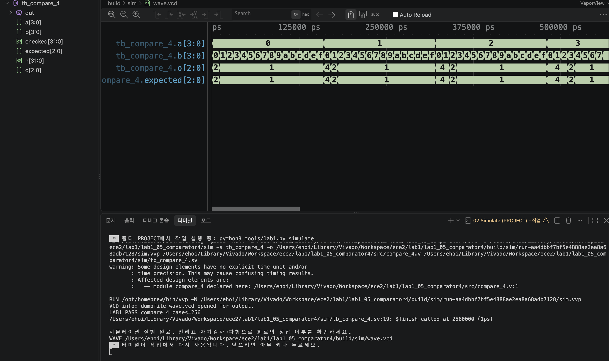

# LAB1 예비보고서 — 05 · 4비트 비교기

> SIMULATED는 컴파일·실행·파형 생성이 끝났다는 뜻이지 PASS 판정이 아니다. 아래 PASS 판정은 테스트벤치의 자기검사(`$fatal` 비교)를 전체 케이스에 대해 통과했다는 뜻이며, 근거는 [evidence/vscode/simulation.log](../../evidence/vscode/simulation.log)와 아래 캡처다.

## 1. 목적 · 포트 · 비트 폭 · 예상표 · 동작 원리

- 설계 top 모듈: `compare_4`
- 포트: 입력 a[3:0], b[3:0] → 출력 o[2:0] (o[2]=a>b, o[1]=a==b, o[0]=a<b)
- 동작 원리: assign o = {a > b, a == b, a < b}; 세 비교 결과 중 정확히 하나만 1이 되도록 3비트로 인코딩한다.

실행 전 예상값 표 (PDF 제공 기준값):

| 입력 | 예상 결과 |
| --- | --- |
| 0 대 0 | 010 |
| 0 대 1 | 001 |
| 1 대 0 | 100 |

*o=100은 a>b(큼), 010은 a==b(같음), 001은 a<b(작음)을 뜻한다.*

## 2. 소스 · 테스트벤치 링크 · 코드 커밋 · 도구 버전

소스 파일:
- [`src/compare_4.v`](../../src/compare_4.v)

테스트벤치: [`sim/tb_compare_4.sv`](../../sim/tb_compare_4.sv) (simulation_top: `tb_compare_4`)

git 커밋: `92f8f81  lab1_05: compare_4 RTL/TB/XDC 작성 및 시뮬레이션 통과`

도구 버전 (01 Check tools 실행 결과):
```
git version 2.55.0
Python 3.9.6
Icarus Verilog version 13.0 (stable)
```

## 3. 입력 조합 · 기대값 · 자동 비교 · 종료 조건

- 입력 조합: {a,b}=n (n=0..255)로 모든 조합을 대입
- 자동 비교 방식: 기대값 = (n/16)>(n%16) ? 4 : ((n/16)==(n%16) ? 2 : 1) 로 100/010/001을 계산해 o와 비교(!==). checked=256 확인 후 LAB1_PASS, $finish.
- 총 검사 수: 256개 × 10ns = 2560ns에 정상 종료
- Watchdog: 100000ns 안에 `$finish`가 호출되지 않으면 강제로 실패 처리한다.

## 4. PASS 로그와 파형 원본 · 캡처

```
LAB1_PASS compare_4 cases=256
$finish called at 2560000 (1ps)  ->  2560ns 종료
```



이 캡처의 터미널에서 위 `LAB1_PASS compare_4 cases=256` 문구를 직접 확인했다.

원본 자료: [simulation.log](../../evidence/vscode/simulation.log) · [wave.vcd](../../evidence/vscode/wave.vcd)

## 5. 시간 구간별 값 해석

아래 표는 위 캡처(사진)에서 실제로 보이는 파형 구간 안의 값이다. 다중 비트는 이진수로 표기했다.

| 시간(ns) | a[3:0] | b[3:0] | o[2:0] |
| --- | --- | --- | --- |
| 5 | 0000 | 0000 | 010 |
| 165 | 0001 | 0000 | 100 |
| 325 | 0010 | 0000 | 100 |
| 485 | 0011 | 0000 | 100 |
| 555 | 0011 | 0111 | 001 |

*캡처(사진)에는 o[2:0]뿐 아니라 테스트벤치 내부 expected[2:0] 신호도 함께 표시되어 있고, 두 파형이 전 구간에서 완전히 겹쳐 자기검사 일치를 시각적으로도 확인할 수 있다. 위 시간은 캡처에 실제로 보이는 0~약 560,000ps 구간(전체 2,560,000ps 중 앞부분) 안의 값이다.*

## 6. 오류 · 수정 · 재실행 & 보드에서 확인할 입력과 출력

PDF 26쪽의 "코드 수정 실험"을 실제로 수행했다: compare_4.v의 가운데 비교(a==b)를 a!=b로 바꾼 뒤 저장하고 02 Simulate를 재실행했다.

- 변경한 코드 (1줄): `assign o = {a > b, a == b, a < b};  →  assign o = {a > b, a != b, a < b};`
- 실패 로그: FAIL compare_4 vector=0 expected=2 actual=0 (Time: 10000) — a=b=0에서 정상 출력은 010(=2, 같음)인데, a!=b로 바뀌며 가운데 비트가 0이 되어 000(실제값 0)으로 실패.
- 복구 후 재실행 결과: a==b로 복구하고 Save All → 02 Simulate 재실행 → LAB1_PASS compare_4 cases=256, $finish called at 2560000 (1ps)로 정상 종료 확인.

보드에서 확인할 입력과 출력: DIP1-4=a[3:0], DIP5-8=b[3:0]. LED1=큼(a>b), LED2=같음(a=b), LED3=작음(a<b).
