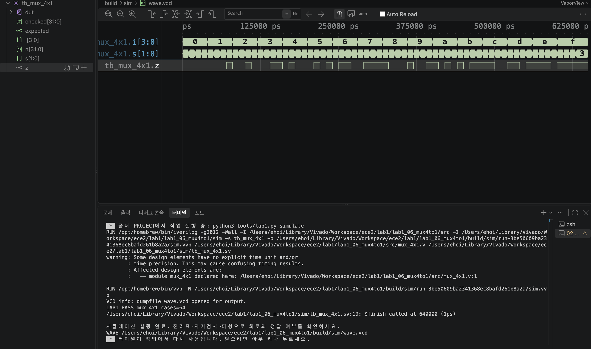

# LAB1 예비보고서 — 06 · 4:1 멀티플렉서

> SIMULATED는 컴파일·실행·파형 생성이 끝났다는 뜻이지 PASS 판정이 아니다. 아래 PASS 판정은 테스트벤치의 자기검사(`$fatal` 비교)를 전체 케이스에 대해 통과했다는 뜻이며, 근거는 [evidence/vscode/simulation.log](../../evidence/vscode/simulation.log)와 아래 캡처다.

## 1. 목적 · 포트 · 비트 폭 · 예상표 · 동작 원리

- 설계 top 모듈: `mux_4x1`
- 포트: 입력 i[3:0], s[1:0] → 출력 z (1비트)
- 동작 원리: assign z = i[3-s]; 선택선 s=00,01,10,11이 각각 i[3],i[2],i[1],i[0]을 z로 내보낸다 (원본 실습의 비트 순서를 그대로 따른다).

실행 전 예상값 표 (PDF 제공 기준값):

| 입력 | 예상 결과 |
| --- | --- |
| i=1000, s=00 | z=1 |
| i=1000, s=01 | z=0 |
| i=0001, s=11 | z=1 |

*s=00은 최상위 비트 i[3]을, s=11은 최하위 비트 i[0]을 선택한다.*

## 2. 소스 · 테스트벤치 링크 · 코드 커밋 · 도구 버전

소스 파일:
- [`src/mux_4x1.v`](../../src/mux_4x1.v)

테스트벤치: [`sim/tb_mux_4x1.sv`](../../sim/tb_mux_4x1.sv) (simulation_top: `tb_mux_4x1`)

git 커밋: `70e858f  lab1_06: mux_4x1 RTL/TB/XDC 작성 및 시뮬레이션 통과`

도구 버전 (01 Check tools 실행 결과):
```
git version 2.55.0
Python 3.9.6
Icarus Verilog version 13.0 (stable)
```

## 3. 입력 조합 · 기대값 · 자동 비교 · 종료 조건

- 입력 조합: {i,s}=n (n=0..63)로 i의 16가지 값과 s의 4가지 값 조합을 대입
- 자동 비교 방식: 기대값 = ((n/4) >> (3-(n%4))) & 1 로 s에 대응하는 i 비트를 계산해 z와 비교(!==). checked=64 확인 후 LAB1_PASS, $finish.
- 총 검사 수: 64개 × 10ns = 640ns에 정상 종료
- Watchdog: 100000ns 안에 `$finish`가 호출되지 않으면 강제로 실패 처리한다.

## 4. PASS 로그와 파형 원본 · 캡처

```
LAB1_PASS mux_4x1 cases=64
$finish called at 640000 (1ps)  ->  640ns 종료
```



이 캡처의 터미널에서 위 `LAB1_PASS mux_4x1 cases=64` 문구를 직접 확인했다.

원본 자료: [simulation.log](../../evidence/vscode/simulation.log) · [wave.vcd](../../evidence/vscode/wave.vcd)

## 5. 시간 구간별 값 해석

아래 표는 위 캡처(사진)에서 실제로 보이는 파형 구간 안의 값이다. 다중 비트는 이진수로 표기했다.

| 시간(ns) | i[3:0] | s[1:0] | z |
| --- | --- | --- | --- |
| 5 | 0000 | 00 | 0 |
| 15 | 0000 | 01 | 0 |
| 35 | 0000 | 11 | 0 |
| 325 | 1000 | 00 | 1 |
| 635 | 1111 | 11 | 1 |

*캡처(사진)는 전체 640,000ps 중 0~약 630,000ps까지를 보여주며(거의 전 구간), 위 5개 시간 모두 화면에서 직접 확인 가능하다. 635ns는 마지막 케이스(i=1111, s=11)로 화면 가장 오른쪽 끝에 해당한다.*

## 6. 오류 · 수정 · 재실행 & 보드에서 확인할 입력과 출력

PDF 25쪽의 "코드 수정 실험"을 실제로 수행했다: mux_4x1.v의 출력 인덱스를 3-s에서 s로 바꾼 뒤 저장하고 02 Simulate를 재실행했다.

- 변경한 코드 (1줄): `assign z = i[3-s];  →  assign z = i[s];`
- 실패 로그: FAIL mux_4x1 vector=4 expected=0 actual=1 (Time: 50000) — i=0001,s=00에서 정상 z=i[3]=0이어야 하는데, 인덱스가 바뀌며 z=i[0]=1이 되어 실패.
- 복구 후 재실행 결과: i[3-s]로 복구하고 Save All → 02 Simulate 재실행 → LAB1_PASS mux_4x1 cases=64, $finish called at 640000 (1ps)로 정상 종료 확인.

보드에서 확인할 입력과 출력: KEY1-4=i[3:0], DIP1-2=s[1:0]. LED1=z.
