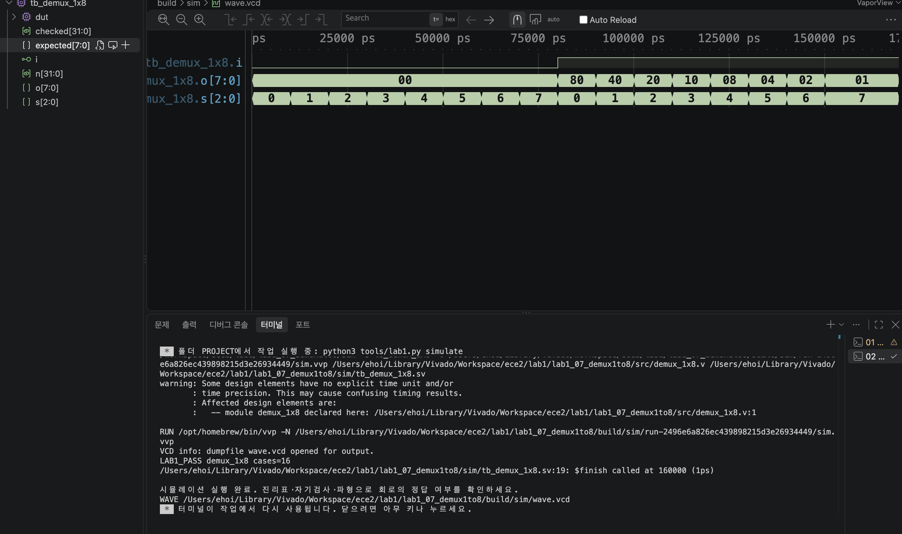

# LAB1 예비보고서 — 07 · 1:8 디먹스

> SIMULATED는 컴파일·실행·파형 생성이 끝났다는 뜻이지 PASS 판정이 아니다. 아래 PASS 판정은 테스트벤치의 자기검사(`$fatal` 비교)를 전체 케이스에 대해 통과했다는 뜻이며, 근거는 [evidence/vscode/simulation.log](../../evidence/vscode/simulation.log)와 아래 캡처다.

## 1. 목적 · 포트 · 비트 폭 · 예상표 · 동작 원리

- 설계 top 모듈: `demux_1x8`
- 포트: 입력 i(1비트), s[2:0] → 출력 o[7:0]
- 동작 원리: assign o = i ? (8'b10000000 >> s) : 8'b0; i=0이면 모든 출력이 0이고, i=1이면 s가 가리키는 한 비트만 1이 된다 (s=000→o[7], s=111→o[0]).

실행 전 예상값 표 (PDF 제공 기준값):

| 입력 | 예상 결과 |
| --- | --- |
| i=0, 모든 s | 00000000 |
| i=1, s=000 | 10000000 |
| i=1, s=111 | 00000001 |

*i가 선택된 한 출력으로만 전달되고 나머지 출력은 항상 0이다.*

## 2. 소스 · 테스트벤치 링크 · 코드 커밋 · 도구 버전

소스 파일:
- [`src/demux_1x8.v`](../../src/demux_1x8.v)

테스트벤치: [`sim/tb_demux_1x8.sv`](../../sim/tb_demux_1x8.sv) (simulation_top: `tb_demux_1x8`)

git 커밋: `30377b4  lab1_07: demux_1x8 RTL/TB/XDC 작성 및 시뮬레이션 통과`

도구 버전 (01 Check tools 실행 결과):
```
git version 2.55.0
Python 3.9.6
Icarus Verilog version 13.0 (stable)
```

## 3. 입력 조합 · 기대값 · 자동 비교 · 종료 조건

- 입력 조합: {i,s}=n (n=0..15)로 16가지 조합을 대입
- 자동 비교 방식: 기대값 = (n>=8) ? (128 >> (n%8)) : 0. o와 비교(!==). checked=16 확인 후 LAB1_PASS, $finish.
- 총 검사 수: 16개 × 10ns = 160ns에 정상 종료
- Watchdog: 100000ns 안에 `$finish`가 호출되지 않으면 강제로 실패 처리한다.

## 4. PASS 로그와 파형 원본 · 캡처

```
LAB1_PASS demux_1x8 cases=16
$finish called at 160000 (1ps)  ->  160ns 종료
```



이 캡처의 터미널에서 위 `LAB1_PASS demux_1x8 cases=16` 문구를 직접 확인했다.

원본 자료: [simulation.log](../../evidence/vscode/simulation.log) · [wave.vcd](../../evidence/vscode/wave.vcd)

## 5. 시간 구간별 값 해석

아래 표는 위 캡처(사진)에서 실제로 보이는 파형 구간 안의 값이다. 다중 비트는 이진수로 표기했다.

| 시간(ns) | i | s[2:0] | o[7:0] |
| --- | --- | --- | --- |
| 5 | 0 | 000 | 00000000 |
| 15 | 0 | 001 | 00000000 |
| 35 | 0 | 011 | 00000000 |
| 85 | 1 | 000 | 10000000 |
| 155 | 1 | 111 | 00000001 |

*캡처(사진)는 전체 160,000ps(=$finish 시각)가 모두 보이므로, 위 5개 시간 전부 화면에서 직접 확인 가능하다. 80~90ns에서 가장 왼쪽 비트, 150~160ns에서 가장 오른쪽 비트가 켜진다.*

## 6. 오류 · 수정 · 재실행 & 보드에서 확인할 입력과 출력

PDF 26쪽의 "코드 수정 실험"을 실제로 수행했다: demux_1x8.v의 오른쪽 시프트를 왼쪽 시프트로 바꾼 뒤 저장하고 02 Simulate를 재실행했다.

- 변경한 코드 (1줄): `assign o = i ? (8'b10000000 >> s) : 8'b0;  →  assign o = i ? (8'b10000000 << s) : 8'b0;`
- 실패 로그: FAIL demux_1x8 vector=9 expected=40 actual=00 (Time: 100000) — i=1,s=001에서 정상 출력은 01000000(=40)인데, 왼쪽 시프트로 바뀌며 8비트를 벗어나 00000000(실제값 00)이 되어 실패.
- 복구 후 재실행 결과: 오른쪽 시프트로 복구하고 Save All → 02 Simulate 재실행 → LAB1_PASS demux_1x8 cases=16, $finish called at 160000 (1ps)로 정상 종료 확인.

보드에서 확인할 입력과 출력: KEY1=i, DIP1-3=s[2:0]. LED1-8=o[7:0].
