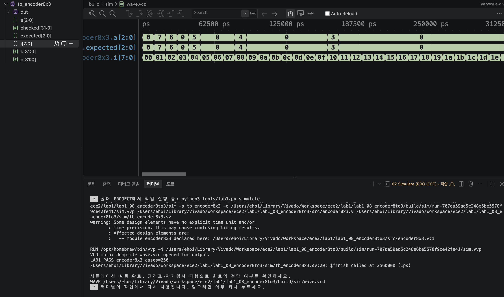

# LAB1 예비보고서 — 08 · 8:3 인코더

> SIMULATED는 컴파일·실행·파형 생성이 끝났다는 뜻이지 PASS 판정이 아니다. 아래 PASS 판정은 테스트벤치의 자기검사(`$fatal` 비교)를 전체 케이스에 대해 통과했다는 뜻이며, 근거는 [evidence/vscode/simulation.log](../../evidence/vscode/simulation.log)와 아래 캡처다.

## 1. 목적 · 포트 · 비트 폭 · 예상표 · 동작 원리

- 설계 top 모듈: `encoder8x3`
- 포트: 입력 i[7:0] → 출력 a[2:0] (reg)
- 동작 원리: always@* case(i)로 8개의 one-hot 입력만 번호로 변환한다 (i[7]=1→0 ... i[0]=1→7). 0 또는 다중 비트(multi-hot) 입력은 모두 default로 000을 출력하며, 우선순위 인코더가 아니다.

실행 전 예상값 표 (PDF 제공 기준값):

| 입력 | 예상 결과 |
| --- | --- |
| 10000000 | 000 |
| 00000001 | 111 |
| 00000011 | 000 (잘못된 입력) |

*세 번째 예(00000011)처럼 비트가 2개 이상 켜지면 유효하지 않은 입력으로 간주해 000을 출력한다.*

## 2. 소스 · 테스트벤치 링크 · 코드 커밋 · 도구 버전

소스 파일:
- [`src/encoder8x3.v`](../../src/encoder8x3.v)

테스트벤치: [`sim/tb_encoder8x3.sv`](../../sim/tb_encoder8x3.sv) (simulation_top: `tb_encoder8x3`)

git 커밋: `78e3ad2  lab1_08: encoder8x3 RTL/TB/XDC 작성 및 시뮬레이션 통과`

도구 버전 (01 Check tools 실행 결과):
```
git version 2.55.0
Python 3.9.6
Icarus Verilog version 13.0 (stable)
```

## 3. 입력 조합 · 기대값 · 자동 비교 · 종료 조건

- 입력 조합: i=n (n=0..255)로 8개 one-hot 값뿐 아니라 256개 입력 전체를 대입
- 자동 비교 방식: k=0..7 중 n==(128>>k)인 경우에만 기대값=k, 그 외에는 0으로 둔다. a와 비교(!==). checked=256 확인 후 LAB1_PASS, $finish.
- 총 검사 수: 256개 × 10ns = 2560ns에 정상 종료
- Watchdog: 100000ns 안에 `$finish`가 호출되지 않으면 강제로 실패 처리한다.

## 4. PASS 로그와 파형 원본 · 캡처

```
LAB1_PASS encoder8x3 cases=256
$finish called at 2560000 (1ps)  ->  2560ns 종료
```



이 캡처의 터미널에서 위 `LAB1_PASS encoder8x3 cases=256` 문구를 직접 확인했다.

원본 자료: [simulation.log](../../evidence/vscode/simulation.log) · [wave.vcd](../../evidence/vscode/wave.vcd)

## 5. 시간 구간별 값 해석

아래 표는 위 캡처(사진)에서 실제로 보이는 파형 구간 안의 값이다. 다중 비트는 이진수로 표기했다.

| 시간(ns) | i[7:0] | a[2:0] |
| --- | --- | --- |
| 5 | 00000000 | 000 |
| 15 | 00000001 | 111 |
| 35 | 00000011 | 000 |
| 85 | 00001000 | 100 |
| 165 | 00010000 | 011 |

*캡처(사진)에는 a[2:0]와 테스트벤치 내부 expected[2:0]가 함께 표시되어 있고, 두 파형이 전 구간에서 완전히 겹쳐 자기검사 일치를 시각적으로도 확인할 수 있다. 위 시간은 캡처에 실제로 보이는 0~약 320,000ps 구간(전체 2,560,000ps 중 앞부분) 안의 값이며, 15ns(01)와 35ns(03)를 비교하면 우선순위 인코더가 아님을 확인할 수 있다.*

## 6. 오류 · 수정 · 재실행 & 보드에서 확인할 입력과 출력

PDF 26쪽의 "코드 수정 실험"을 실제로 수행했다: encoder8x3.v에서 입력 00000001(8'h01)에 대응하는 출력 상수를 7에서 6으로 바꾼 뒤 저장하고 02 Simulate를 재실행했다.

- 변경한 코드 (1줄): `8'h01: a=7;  →  8'h01: a=6;`
- 실패 로그: FAIL encoder8x3 vector=1 expected=7 actual=6 (Time: 20000) — 입력 00000001의 정상 출력은 111(=7)인데, 상수를 바꾸며 110(실제값 6)이 되어 실패.
- 복구 후 재실행 결과: 7로 복구하고 Save All → 02 Simulate 재실행 → LAB1_PASS encoder8x3 cases=256, $finish called at 2560000 (1ps)로 정상 종료 확인.

보드에서 확인할 입력과 출력: KEY1-8=i[7:0]. LED1-3=a[2:0]. 출력 000만으로는 유효 입력 여부를 판단할 수 없다.
