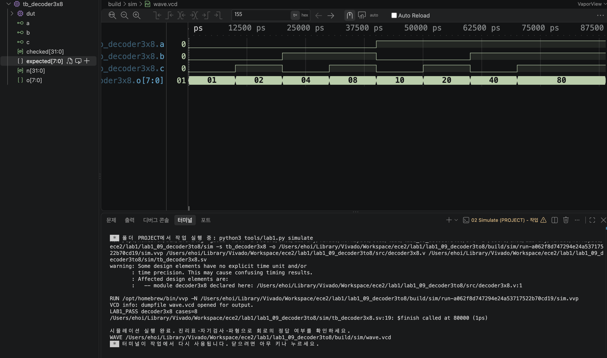

# LAB1 예비보고서 — 09 · 3:8 디코더

> SIMULATED는 컴파일·실행·파형 생성이 끝났다는 뜻이지 PASS 판정이 아니다. 아래 PASS 판정은 테스트벤치의 자기검사(`$fatal` 비교)를 전체 케이스에 대해 통과했다는 뜻이며, 근거는 [evidence/vscode/simulation.log](../../evidence/vscode/simulation.log)와 아래 캡처다.

## 1. 목적 · 포트 · 비트 폭 · 예상표 · 동작 원리

- 설계 top 모듈: `decoder3x8`
- 포트: 입력 a, b, c (각 1비트) → 출력 o[7:0]
- 동작 원리: assign o = 8'b00000001 << {a,b,c}; abc의 이진값과 같은 위치의 비트 하나만 1이 된다 (000→o[0], 111→o[7]).

실행 전 예상값 표 (PDF 제공 기준값):

| 입력 | 예상 결과 |
| --- | --- |
| 000 | 00000001 |
| 011 | 00001000 |
| 111 | 10000000 |

*입력이 1 증가할 때마다 켜지는 비트가 한 칸씩 왼쪽으로 이동한다.*

## 2. 소스 · 테스트벤치 링크 · 코드 커밋 · 도구 버전

소스 파일:
- [`src/decoder3x8.v`](../../src/decoder3x8.v)

테스트벤치: [`sim/tb_decoder3x8.sv`](../../sim/tb_decoder3x8.sv) (simulation_top: `tb_decoder3x8`)

git 커밋: `fafc0da  lab1_09: decoder3x8 RTL/TB/XDC 작성 및 시뮬레이션 통과`

도구 버전 (01 Check tools 실행 결과):
```
git version 2.55.0
Python 3.9.6
Icarus Verilog version 13.0 (stable)
```

## 3. 입력 조합 · 기대값 · 자동 비교 · 종료 조건

- 입력 조합: {a,b,c}=n (n=0..7)로 000~111을 대입
- 자동 비교 방식: 기대값 = 1<<n. o와 비교(!==). checked=8 확인 후 LAB1_PASS, $finish.
- 총 검사 수: 8개 × 10ns = 80ns에 정상 종료
- Watchdog: 100000ns 안에 `$finish`가 호출되지 않으면 강제로 실패 처리한다.

## 4. PASS 로그와 파형 원본 · 캡처

```
LAB1_PASS decoder3x8 cases=8
$finish called at 80000 (1ps)  ->  80ns 종료
```



이 캡처의 터미널에서 위 `LAB1_PASS decoder3x8 cases=8` 문구를 직접 확인했다.

원본 자료: [simulation.log](../../evidence/vscode/simulation.log) · [wave.vcd](../../evidence/vscode/wave.vcd)

## 5. 시간 구간별 값 해석

아래 표는 위 캡처(사진)에서 실제로 보이는 파형 구간 안의 값이다. 다중 비트는 이진수로 표기했다.

| 시간(ns) | a | b | c | o[7:0] |
| --- | --- | --- | --- | --- |
| 5 | 0 | 0 | 0 | 00000001 |
| 15 | 0 | 0 | 1 | 00000010 |
| 35 | 0 | 1 | 1 | 00001000 |
| 45 | 1 | 0 | 0 | 00010000 |
| 75 | 1 | 1 | 1 | 10000000 |

*캡처(사진)는 전체 87,500ps까지 보이며(전체 80,000ps보다 넓은 범위), 위 5개 시간 전부 화면에서 직접 확인 가능하다.*

## 6. 오류 · 수정 · 재실행 & 보드에서 확인할 입력과 출력

PDF 26쪽의 "코드 수정 실험"을 실제로 수행했다: decoder3x8.v의 왼쪽 시프트를 오른쪽 시프트로 바꾼 뒤 저장하고 02 Simulate를 재실행했다.

- 변경한 코드 (1줄): `assign o = 8'b00000001 << {a,b,c};  →  assign o = 8'b00000001 >> {a,b,c};`
- 실패 로그: FAIL decoder3x8 vector=1 expected=02 actual=00 (Time: 20000) — abc=001의 정상 출력은 00000010(=02)인데, 오른쪽 시프트로 바뀌며 비트가 범위를 벗어나 00000000(실제값 00)이 되어 실패.
- 복구 후 재실행 결과: 왼쪽 시프트로 복구하고 Save All → 02 Simulate 재실행 → LAB1_PASS decoder3x8 cases=8, $finish called at 80000 (1ps)로 정상 종료 확인.

보드에서 확인할 입력과 출력: KEY1=a, KEY2=b, KEY3=c. LED1-8=o[7:0]이므로 000에서 LED8, 111에서 LED1이 켜진다.
