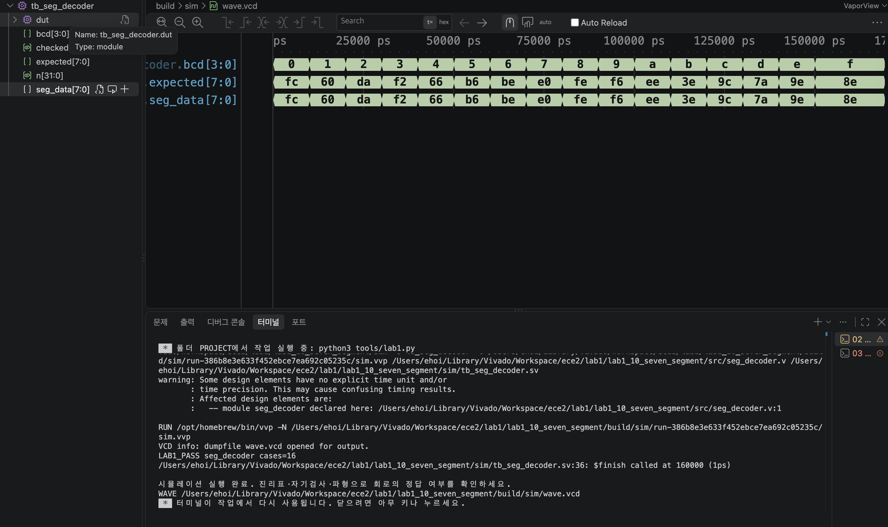

# LAB1 예비보고서 — 10 · 7세그먼트 디코더

> SIMULATED는 컴파일·실행·파형 생성이 끝났다는 뜻이지 PASS 판정이 아니다. 아래 PASS 판정은 테스트벤치의 자기검사(`$fatal` 비교)를 전체 케이스에 대해 통과했다는 뜻이며, 근거는 [evidence/vscode/simulation.log](../../evidence/vscode/simulation.log)와 아래 캡처다.

## 1. 목적 · 포트 · 비트 폭 · 예상표 · 동작 원리

- 설계 top 모듈: `seg_decoder`
- 포트: 입력 bcd[3:0] → 출력 seg_data[7:0] ({a,b,c,d,e,f,g,dp} 순서, 1=점등, dp는 항상 0)
- 동작 원리: always@* case(bcd)로 0~F 16개 입력 각각에 대응하는 세그먼트 점등 패턴을 8비트 상수로 출력한다.

실행 전 예상값 표 (PDF 제공 기준값):

| 입력 | 예상 결과 |
| --- | --- |
| 0 | FC: a,b,c,d,e,f |
| 1 | 60: b,c |
| 8 | FE: a-g |
| F | 8E: a,e,f,g |

*8은 일곱 획이 모두 켜지고(FE), dp 비트는 항상 0으로 꺼져 있다.*

## 2. 소스 · 테스트벤치 링크 · 코드 커밋 · 도구 버전

소스 파일:
- [`src/seg_decoder.v`](../../src/seg_decoder.v)

테스트벤치: [`sim/tb_seg_decoder.sv`](../../sim/tb_seg_decoder.sv) (simulation_top: `tb_seg_decoder`)

git 커밋: `4bc1bd3  lab1_10: seg_decoder RTL/TB/XDC 작성 및 시뮬레이션 통과`

도구 버전 (01 Check tools 실행 결과):
```
git version 2.55.0
Python 3.9.6
Icarus Verilog version 13.0 (stable)
```

## 3. 입력 조합 · 기대값 · 자동 비교 · 종료 조건

- 입력 조합: bcd=n (n=0..15)로 0~F를 대입
- 자동 비교 방식: 교안에서 정의한 0~F의 기대 점등 패턴 16개를 TB의 digits[0:15] 배열에 별도로 정의하고, 이를 기대값으로 실제 seg_data와 비교(!==)한다. checked=16 확인 후 LAB1_PASS, $finish.
- 총 검사 수: 16개 × 10ns = 160ns에 정상 종료
- Watchdog: 100000ns 안에 `$finish`가 호출되지 않으면 강제로 실패 처리한다.

## 4. PASS 로그와 파형 원본 · 캡처

```
LAB1_PASS seg_decoder cases=16
$finish called at 160000 (1ps)  ->  160ns 종료
```



이 캡처의 터미널에서 위 `LAB1_PASS seg_decoder cases=16` 문구를 직접 확인했다.

원본 자료: [simulation.log](../../evidence/vscode/simulation.log) · [wave.vcd](../../evidence/vscode/wave.vcd)

## 5. 시간 구간별 값 해석

아래 표는 위 캡처(사진)에서 실제로 보이는 파형 구간 안의 값이다. 다중 비트는 이진수로 표기했다.

| 시간(ns) | bcd[3:0] | seg_data[7:0] |
| --- | --- | --- |
| 5 | 0000 | 11111100 |
| 15 | 0001 | 01100000 |
| 35 | 0011 | 11110010 |
| 85 | 1000 | 11111110 |
| 155 | 1111 | 10001110 |

*캡처(사진)에는 seg_data[7:0]와 테스트벤치 내부 expected[7:0]가 함께 표시되어 있고, 두 파형이 전 구간에서 완전히 겹쳐 자기검사 일치를 시각적으로도 확인할 수 있다. 전체 160,000ps(=$finish 시각)가 모두 보이므로 위 5개 시간 전부 화면에서 직접 확인 가능하다.*

## 6. 오류 · 수정 · 재실행 & 보드에서 확인할 입력과 출력

PDF 29쪽의 "코드 수정 실험"을 실제로 수행했다: seg_decoder.v에서 숫자 0의 패턴을 1의 패턴으로 바꾼 뒤 저장하고 02 Simulate를 재실행했다.

- 변경한 코드 (1줄): `0:seg_data=8'hfc;  →  0:seg_data=8'h60;`
- 실패 로그: FAIL seg_decoder vector=0 expected=fc actual=60 (Time: 10000) — bcd=0의 정상 패턴은 FC인데, 1의 패턴(60)으로 바뀌어 실패.
- 복구 후 재실행 결과: FC로 복구하고 Save All → 02 Simulate 재실행 → LAB1_PASS seg_decoder cases=16, $finish called at 160000 (1ps)로 정상 종료 확인.

보드에서 확인할 입력과 출력: DIP1-4=bcd[3:0]. 단일 7세그먼트 a-dp. 이름은 bcd지만 입력 10-15도 A,b,C,d,E,F로 정의한다.
