# LAB3 수정실험 결과 (실험 전 레포트용 자료)

- 도구: Icarus Verilog 12 (`iverilog -g2012 -Wall`, 기준 결과)와 Vivado 2025.2 XSim(교차 확인). 두 도구의 PASS/FAIL과 `$fatal` 메시지·시각은 모두 같고, 07번 종료 시각만 60 ns 다르다(아래 07 참고).
- 방법: 정상 프로젝트(`lab3/lab3_0N_*`)는 건드리지 않고, 소스 사본 두 벌을 만들어 한쪽(`modified/`)만 **한 항목** 수정, 다른 쪽(`restored/`)은 원본 그대로 실행해 복구 PASS를 확인했다.
- TB의 기대값은 어떤 실험에서도 바꾸지 않았다.
- 폴더 구성: `0N_*/modification.diff`(변경 내용) · `modified/`, `restored/`(각각 src·sim·simulation.json, `icarus/`(compile.log·icarus.log·wave.vcd), `xsim/`(xsim.log·wave.vcd))
- 파형 캡처(Icarus VCD 기준): `../images/mod/0N_*_{restored,modified}.png`(넓은 판, 설명 포함) · `../images/col/`(보고서 2단용). 정상=복구 그림과 수정 그림은 같은 신호, 같은 시간 창이다.

## 요약

| # | 실험 | 수정 항목 (파일) | 수정 결과 | 복구 결과 |
|---|---|---|---|---|
| 01 | PWM LED | `LEVELS` 10 → 5 (TB 인스턴스) | **FAIL** `level=3 high=6` @1231 ns | PASS `checks=4` @3831 ns |
| 02 | RGB PWM | `level_r` 리셋값 0 → 3 (RTL) | **FAIL** `rgb high=5,5,8` @3851 ns | PASS `checks=2` @4431 ns |
| 03 | 피에조 | `TONE_HZ` 100 → 125 (TB 인스턴스) | **FAIL** `half period=4` @191 ns | PASS `edges=5` @551 ns |
| 04 | 스텝모터 | `STEP_HZ` 2 → 1 (TB 인스턴스) | PASS `checks=8`, 종료 831 → **1311 ns** | PASS `checks=8` @831 ns |
| 05 | MM:SS | TB의 `mmss_counter` `CLK_HZ` 2 → 4 | **FAIL** `time=00:05` @431 ns | PASS `checks=7` @144031 ns |
| 06 | 문자 LCD | index 37 `"R"` → `"S"` (RTL) | **FAIL** `index=37 rs=1 data=53` @7730 ns | PASS `bytes=40` @8130 ns |
| 07 | UART | `BAUD` 100 → 200, TB `DIV` 8 → 4 (양쪽 동일) | PASS `checks=3`, 종료 9970 → **5170 ns** (XSim 9910 → 5110) | PASS `checks=3` @9970 ns |

FAIL이 난 5개 실험은 모두 TB가 동작 변화를 검출한 것이다. 4·7번은 PASS가 정상이다. 수정한 값이 TB 조건과 모순되지 않고, 간격만 바뀌기 때문이다.

---

## 01 · PWM LED 밝기 — LEVELS 10 → 5

```diff
-    lab3_led_pwm #(.CLK_HZ(1000),.PWM_HZ(100),.LEVELS(10),.DEBOUNCE_CYCLES(2)) dut
+    lab3_led_pwm #(.CLK_HZ(1000),.PWM_HZ(100),.LEVELS(5),.DEBOUNCE_CYCLES(2)) dut
```

TB가 `LEVELS`를 덮어쓰므로 TB 인스턴스에서 바꿨다. RTL 기본값만 바꾸면 시뮬레이션에는 반영되지 않는다.

| 구분 | 내용 |
|---|---|
| 예상값 | PERIOD = 1000/100 = 10클록. 버튼 3회 → level=3 → threshold = 10×3/5 = **6** → HIGH 6클록(60%). TB 기대 3과 달라 FAIL 예상 |
| 실제 (수정) | `$fatal level=3 high=6` (1231 ns). 파형에서 threshold 0→2→4→6, 단계마다 20%씩 증가 |
| 복구 | LEVELS=10 → threshold 0→1→2→3, HIGH 3클록 → `LAB3_LED_PWM_PASS checks=4` |

보드 기준 (50 MHz, PWM 1 kHz): PERIOD = 50,000클록. level 3의 threshold는 15,000(30%)에서 30,000(60%)으로 바뀐다. 단계 수도 11단계(0~100%, 10%씩)에서 6단계(0~100%, 20%씩)로 줄어서, 버튼 6번이면 한 바퀴가 돈다.

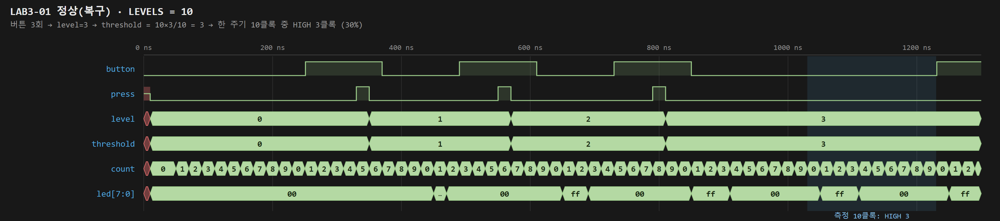
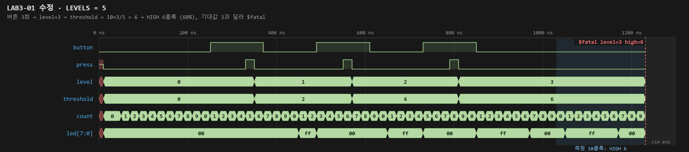

## 02 · RGB LED PWM — R 초기 duty 0 → 30 %

```diff
-            level_r <= 0; level_g <= 0; level_b <= 0;
+            level_r <= 4'd3; level_g <= 0; level_b <= 0;
```

| 구분 | 내용 |
|---|---|
| 예상값 | R은 3에서 시작해 2회 증가하므로 level_r=5. (R,G,B) HIGH = 5/5/8클록이 되어 기대 2/5/8과 다름 → FAIL |
| 실제 (수정) | `$fatal rgb high=5,5,8` (3851 ns). pwm_r의 HIGH 폭이 pwm_g와 같아짐 (R=G=50%) |
| 복구 | (2,5,8) → 20/50/80%, 이어서 R 1회 → (3,5,8) → `LAB3_RGB_PWM_PASS checks=2` |

혼합색: 정상 (20,50,80)%는 파랑 위주의 청록이다. 수정하면 (50,50,80)%가 되어 R이 더해진 연보라·흰색 쪽으로 이동한다. 보드에서는 리셋 직후부터 R만 30%로 켜진다.

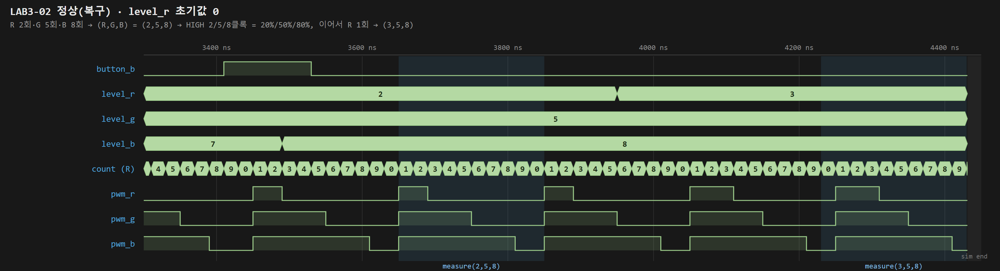
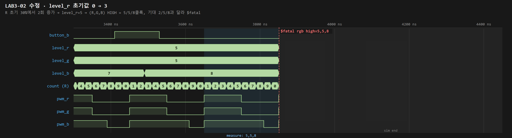

## 03 · 피에조 단일 음 — TONE_HZ 변경

```diff
-    lab3_piezo #(.CLK_HZ(1000),.TONE_HZ(100)) dut(...);
+    lab3_piezo #(.CLK_HZ(1000),.TONE_HZ(125)) dut(...);
```

TB는 가속 파라미터(CLK_HZ=1000)를 쓰므로, 음 높이 비율을 1.25배로 줄여 적용했다. 294 Hz(D4)를 370 Hz(F#4)로 바꾸는 것과 거의 같은 비율(1.258)이다.

| 구분 | 내용 |
|---|---|
| 예상값 | HALF_PERIOD = 1000/(2×125) = **4**클록. TB 기대 반주기 5와 달라 FAIL |
| 실제 (수정) | `$fatal half period=4` (191 ns). count가 0~3만 돌고 4클록(80 ns)마다 piezo 반전 |
| 복구 | HALF_PERIOD 5 → 100 ns마다 반전 → `LAB3_PIEZO_PASS edges=5` |

보드 기준 분주값: 294 Hz는 HALF = 50,000,000/(2×294) = **85,034** → 실제 294.000 Hz. 370 Hz는 HALF = **67,567** → 실제 370.003 Hz. 분주값이 작아질수록 높은 음이 난다.

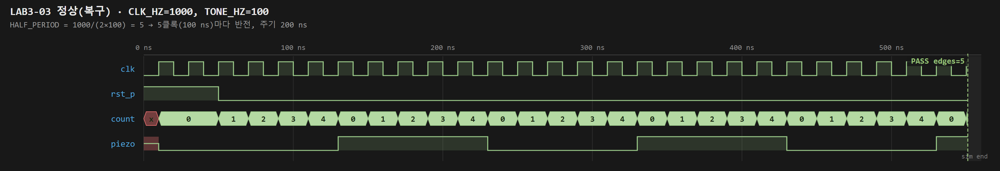
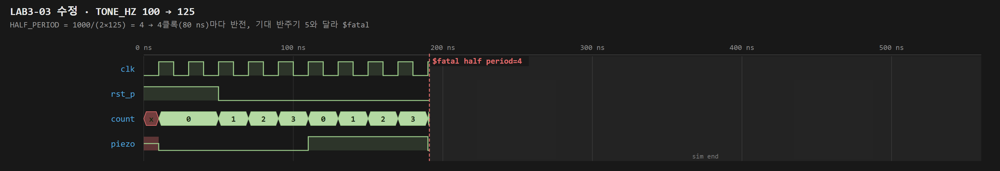

## 04 · 스텝모터 — STEP_HZ 절반

```diff
-    lab3_stepper #(.CLK_HZ(8),.STEP_HZ(2)) dut
+    lab3_stepper #(.CLK_HZ(8),.STEP_HZ(1)) dut
```

| 구분 | 내용 |
|---|---|
| 예상값 | STEP_CYCLES = 8/1 = 8클록(160 ns), 정상의 2배. TB는 `wait(state==N)`으로 순서만 검사하므로 PASS, 종료 시각만 늦어질 것 |
| 실제 (수정) | `LAB3_STEPPER_PASS checks=8`, 종료 831 → **1311 ns**. count가 0~7까지 돌고 상 간격이 2배 |
| 복구 | STEP_CYCLES 4 → 80 ns 간격, 종료 831 ns, PASS |

보드 기준: STEP_HZ 100 → 50이면 STEP_CYCLES가 500,000에서 1,000,000으로 늘고, 한 상 간격은 10 ms에서 20 ms가 된다. 회전 속도는 절반이다(RPM = STEP_HZ × 60 / 1회전 스텝 수).

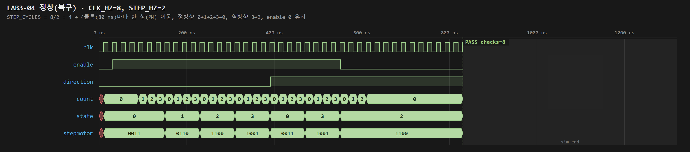
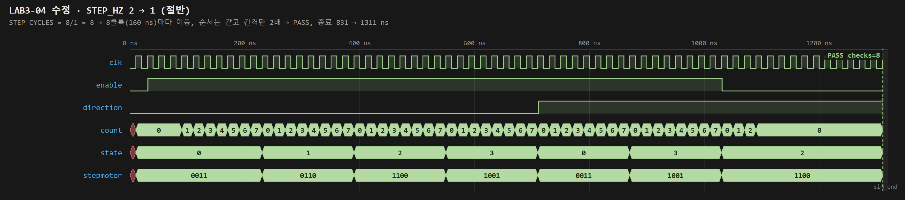

## 05 · MM:SS 시계 — TB CLK_HZ 2 → 4 (TB 클록 20 ns 유지)

```diff
-    mmss_counter #(.CLK_HZ(2)) dut(...);
+    mmss_counter #(.CLK_HZ(4)) dut(...);
```

| 구분 | 내용 |
|---|---|
| 예상값 | 1초 = 4클록. TB `advance(10)`은 `seconds*2` = 20클록을 기다리므로 5초만 진행 → 00:05 → FAIL |
| 실제 (수정) | `$fatal time=00:05` (431 ns). subsecond 0~3 순환, second_ones 1 증가 간격 80 ns |
| 복구 | 2클록(40 ns)마다 1초 → 00:10 자리올림, 이후 01:00, 59:59 → 00:00까지 → `LAB3_MMSS_PASS checks=7` |

보드 기준: 이 값은 TB 전용 파라미터라서 bitstream(top의 CLK_HZ = 50,000,000)에는 영향이 없다. 같은 현상을 보드에서 보려면 top의 CLK_HZ를 100,000,000으로 바꾸면 된다. 그러면 1초 표시에 실제 2초가 걸린다.

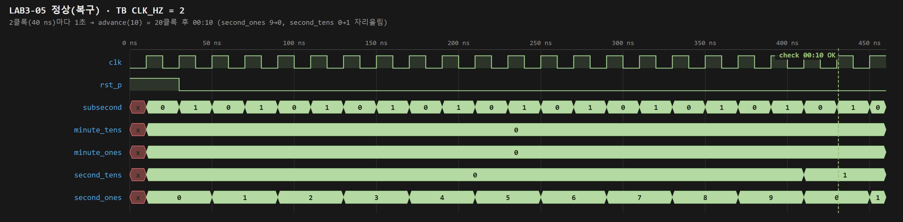
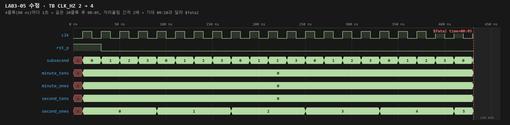

## 06 · 문자 LCD — 둘째 줄 한 글자 변경

```diff
-            37: begin byte_rs=1; byte_data="R"; end
+            37: begin byte_rs=1; byte_data="S"; end
```

| 구분 | 내용 |
|---|---|
| 예상값 | 둘째 줄 "LCD CONTROLLER" → "LCD CONTROLLES". ASCII 0x52(0101_0010) → 0x53(0101_0011)로 lcd_data[0]만 바뀜. 38번째 바이트에서 FAIL |
| 실제 (수정) | `$fatal index=37 rs=1 data=53` (7730 ns). 앞의 37바이트(초기화 7 + 문자)는 모두 일치 |
| 복구 | index 37 = 'R' 0x52 → `LAB3_LCD_PASS bytes=40` |

보드 기준: LCD 둘째 줄 14번째 칸이 R에서 S로 바뀌어 보인다. 둘째 줄 주소는 0xC0 + 13 = DDRAM 0x4D다.

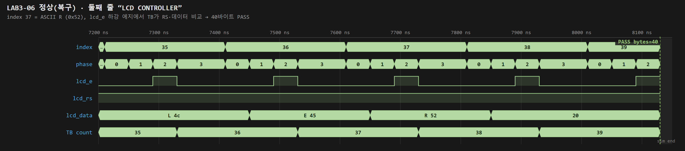
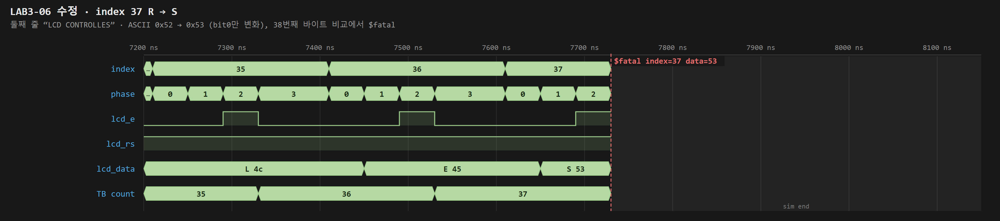

## 07 · UART 에코 — BAUD 2배 (송수신 양쪽 동일)

```diff
-    localparam integer DIV=8;
+    localparam integer DIV=4;
-    lab3_uart_echo #(.CLK_HZ(800),.BAUD(100)) dut
+    lab3_uart_echo #(.CLK_HZ(800),.BAUD(200)) dut
```

| 구분 | 내용 |
|---|---|
| 예상값 | DIV = (800+100)/200 = 4 → 1 bit 80 ns, 1 frame 800 ns. TB 모델도 DIV=4이므로 PASS, 전체 시간은 약 절반 |
| 실제 (수정) | `LAB3_UART_ECHO_PASS checks=3`, 종료 9970 → **5170 ns** (XSim 9910 → 5110). 같은 3400 ns 창에 0x41·0x5A 두 바이트 에코 |
| 복구 | DIV = (800+50)/100 = 8 → 1 bit 160 ns → PASS (Icarus 9970 ns, XSim 9910 ns) |

Icarus와 XSim의 60 ns 차이: TB가 클록 상승 에지 직후 blocking 대입으로 `uart_rxd`를 바꾸므로, 같은 에지에서 DUT 동기화 FF가 새 값을 읽는지(XSim, start 인식 110 ns) 이전 값을 읽는지(Icarus, 130 ns)가 시뮬레이터마다 다르다. 바이트당 1클록 × 3 = 60 ns이며, `receive_byte`가 `uart_txd` 하강 에지에 다시 맞추므로 PASS에는 영향이 없다.

보드 기준: 9600 baud는 DIV = **5208**(1 bit 104.16 µs, 실제 9600.6 baud, 오차 +0.006%)이다. 19200 baud는 DIV = **2604**(52.08 µs, 19201.2 baud, +0.006%)다. PC 터미널도 같은 baud로 바꿔야 한다. 한쪽만 바꾸면 bit 샘플 위치가 어긋나 글자가 깨지거나 framing error가 난다.

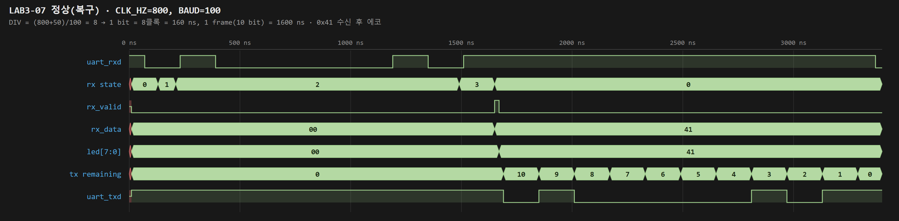
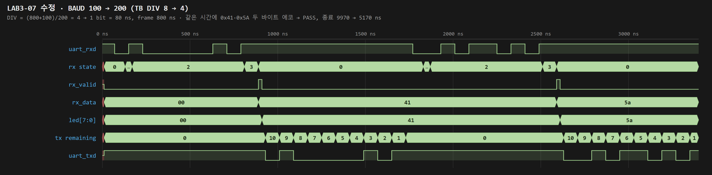
